# @voyage_ai/v402-web-ts

Frontend browser SDK for quick integration with v402pay platform, supporting payment functionality on Solana (SVM) and Ethereum (EVM) chains.

## 📖 What is v402pay?

v402pay is a decentralized payment platform that helps developers quickly integrate Web3 payment features. After a successful payment, the platform automatically calls your configured callback interface to complete the delivery process.

### Payment Flow

v402pay uses a TCC-like two-phase commit pattern to ensure charges only occur after business logic succeeds:


**Key Features:**

1. **Two-Phase Commit**: Verify payment first, execute business logic, then settle based on business result
2. **Business First**: No charge if business logic fails, avoiding charge-but-no-delivery scenarios
3. **Offline Signing**: User signs transaction offline; only broadcasts on-chain after business success
4. **Atomicity**: Either both business and payment succeed, or neither does

### Delivery Modes

#### Current: Immediate Delivery ⚡

The current implementation uses **immediate delivery** mode:

- **When it happens**: Business callback is triggered immediately after payment verification (Phase 2)
- **Settlement timing**: On-chain settlement happens after business logic completes
- **Best for**:
  - Digital content delivery (articles, videos, API access)
  - Services without inventory management
  - Use cases where settlement failure has minimal platform impact
- **Benefits**:
  - ✅ Fast user experience
  - ✅ Lower latency
  - ✅ User safety guaranteed (no charge if business fails)

**Trade-off**: If settlement fails after business execution, the platform bears minor risk as content was already delivered.

##### Sequence Diagram

```mermaid
sequenceDiagram
    participant User
    participant SDK as v402pay platform
    participant x402 as v402(Provided by x402)
    participant Business as Your Business
    participant Chain as Blockchain

    Note over User,Business: First Request - No Payment Info
    User->>Business: 1. Request content (no payment)
    Business->>x402: Check payment
    x402->>x402: No payment found
    x402-->>User: 402 Payment Required<br/>(amount, address, params)
    
    Note over User,SDK: User Payment Flow
    User->>SDK: 2. Initiate payment
    SDK->>User: Connect wallet (Phantom/MetaMask)
    User->>SDK: 3. Sign transaction (offline)
    Note right of SDK: Signature created,<br/>not on-chain yet
    
    Note over User,Business: Second Request - With Payment Signature
    User->>Business: 4. Request with payment signature
    Business->>x402: Verify payment
    
    rect rgb(240, 248, 255)
        Note right of x402: Phase 1: Verify
        x402->>x402: Check signature validity
        x402->>x402: Check amount & address
        x402->>x402: ✅ Verification passed
    end
    
    rect rgb(240, 255, 240)
        Note right of x402: Phase 2: Execute
        x402->>Business: Pass through request
        Business->>Business: 5. Query database
        Business->>Business: Generate content
    end
    
    rect rgb(255, 250, 240)
        Note right of x402: Phase 3: Check Response
        Business-->>x402: 200 OK + business data
        x402->>x402: Status < 400, proceed
    end
    
    rect rgb(255, 240, 245)
        Note right of x402: Phase 4: Settle
        x402->>Chain: 6. Broadcast signed transaction
        Chain->>Chain: Process & confirm transaction
        Chain-->>x402: Transaction hash + confirmation
        x402->>x402: 7. Record to database<br/>(txHash, status)
    end
    
    x402-->>User: 200 OK + business data<br/>+ X-PAYMENT-RESPONSE
    User->>User: 8. Display content & tx info
```



**Key Points:**

1. **Two Requests**: First request returns 402, second request includes payment signature
2. **Offline Signing**: User signs in wallet without broadcasting to blockchain
3. **Verify → Execute → Check → Settle**: Four-phase process ensures safety
4. **Immediate Delivery**: Your business service executes and returns content immediately after verification
5. **Settlement After Business**: On-chain transaction only happens after business confirms success
6. **User Safety**: If business fails (status >= 400), no settlement occurs, no charge

#### Roadmap: Delayed Delivery 🔮

We're planning to offer **delayed delivery** mode as an optional feature:


- **When it happens**: Business callback is triggered only after on-chain settlement succeeds
- **Inventory locking**: Inventory is locked during verification, released on rollback
- **Best for**:
  - Physical goods delivery
  - Asset-based businesses (NFTs, tokens, securities)
  - High-value transactions requiring strong consistency
  - Scenarios where inventory management is critical
- **Benefits**:
  - ✅ Zero platform risk (no delivery before payment confirmation)
  - ✅ Strong consistency guarantees
  - ✅ Distributed transaction safety
  - ✅ Automatic rollback on failure

**How it works**:
1. **Verify Phase**: Lock resources/inventory, but don't deliver yet
2. **Settle Phase**: Attempt on-chain settlement
3. **On Success**: v402pay platform triggers your delivery callback API
4. **On Failure**: v402pay platform triggers your rollback callback API to release locks

This feature will be provided by the v402pay platform with configurable options for different merchant needs.

## 🚀 Quick Start

### 1. Register on v402pay Platform

Visit [v402pay Platform](https://v402pay.com) to create your merchant account:

1. Register an account
2. Create merchant configuration:
   - **Callback URL**: API endpoint called after successful payment
   - **Payment Price**: Fee per access (e.g., 0.01 USDC)
   - **Supported Networks**: Solana, Ethereum, Polygon, etc.
   - **Recipient Address**: Your receiving wallet address
3. Get your **merchantId** (for frontend integration)

### 2. Install SDK

```bash
npm install @voyage_ai/v402-web-ts
```

### 3. Two Usage Methods

## Method 1: Use Built-in Components (Recommended, Ready to Use)

Perfect for quick integration with pre-built UI components handling wallet connection and payment logic.

```tsx
import React from 'react';
import { 
  useWallet, 
  usePayment, 
  usePaymentInfo,
  WalletConnect 
} from '@voyage_ai/v402-web-ts/react';
import { makePayment } from '@voyage_ai/v402-web-ts';
import '@voyage_ai/v402-web-ts/react/styles.css';

export default function PaymentPage() {
  const merchantId = 'your-merchant-id'; // Get from v402pay
  
  // Use React Hooks to manage state
  const { address, networkType } = useWallet();
  const { isProcessing, setIsProcessing, result, setResult, error, setError } = usePayment();
  const { supportedNetworks, isLoading } = usePaymentInfo(merchantId);

  const handlePayment = async () => {
    if (!networkType) return;
    
    setIsProcessing(true);
    setError(null);
    
    try {
      // Initiate payment
      const response = await makePayment(networkType, merchantId);
      const data = await response.json();
      
      // Payment successful, data contains your callback API response
      setResult(data);
      console.log('✅ Payment successful!', data);
    } catch (err: any) {
      setError(err.message || 'Payment failed');
    } finally {
      setIsProcessing(false);
    }
  };

  return (
    <div>
      <h1>Purchase Content</h1>
      
      {/* Wallet Connection Component (Built-in UI) */}
      {!isLoading && (
        <WalletConnect 
          supportedNetworks={supportedNetworks}
        />
      )}
      
      {/* Payment Button */}
      {address && (
        <button 
          onClick={handlePayment} 
          disabled={isProcessing}
        >
          {isProcessing ? 'Processing...' : 'Pay Now'}
        </button>
      )}
      
      {/* Display Result */}
      {result && (
        <div>
          <h2>Payment Successful! 🎉</h2>
          <pre>{JSON.stringify(result, null, 2)}</pre>
        </div>
      )}
      
      {error && <p style={{ color: 'red' }}>{error}</p>}
    </div>
  );
}
```

## Method 2: Custom Wallet Integration

If you already have your own wallet connection logic, you can directly call the payment handler functions.

```typescript
import { 
  handleSvmPayment,  // Solana payment
  handleEvmPayment,  // Ethereum payment
  NetworkType 
} from '@voyage_ai/v402-web-ts';

// Solana Payment Example
async function paySolana() {
  const merchantId = 'your-merchant-id';
  
  // Ensure user has connected Phantom wallet
  const wallet = window.solana;
  if (!wallet) {
    throw new Error('Please install Phantom wallet');
  }
  
  await wallet.connect();
  
  // Call SVM payment
  const response = await handleSvmPayment(
    merchantId,
    wallet  // Pass your wallet adapter
  );
  
  const result = await response.json();
  console.log('Payment result:', result);
}

// Ethereum Payment Example
async function payEthereum() {
  const merchantId = 'your-merchant-id';
  const { ethers } = await import('ethers');
  
  // Connect MetaMask
  const provider = new ethers.BrowserProvider(window.ethereum);
  const signer = await provider.getSigner();
  
  // Create wallet adapter
  const walletAdapter = {
    getAddress: async () => await signer.getAddress(),
    signTypedData: async (domain: any, types: any, value: any) => {
      return await signer.signTypedData(domain, types, value);
    },
    switchChain: async (chainId: string) => {
      await window.ethereum.request({
        method: 'wallet_switchEthereumChain',
        params: [{ chainId }],
      });
    },
  };
  
  // Call EVM payment
  const response = await handleEvmPayment(
    merchantId,
    walletAdapter
  );
  
  const result = await response.json();
  console.log('Payment result:', result);
}
```

## 📚 API Documentation

### React Hooks

#### `useWallet()`

Manage wallet connection state.

```typescript
const { 
  address,        // Wallet address (string | null)
  networkType,    // Network type (NetworkType | null)
  isConnecting,   // Is connecting (boolean)
  error,          // Error message (string | null)
  connect,        // Connect wallet function (networkType: NetworkType) => Promise<void>
  disconnect,     // Disconnect function () => void
  clearError      // Clear error function () => void
} = useWallet();
```

#### `usePayment()`

Manage payment state.

```typescript
const {
  isProcessing,   // Is processing (boolean)
  result,         // Payment result (any)
  error,          // Error message (string | null)
  setIsProcessing, // Set processing state
  setResult,      // Set result
  setError,       // Set error
  clearResult,    // Clear result
  clearError,     // Clear error
  reset           // Reset all states
} = usePayment();
```

#### `usePaymentInfo(merchantId: string)`

Fetch merchant payment configuration.

```typescript
const {
  supportedNetworks,  // Supported networks list (NetworkType[])
  isLoading,          // Is loading (boolean)
  error              // Error message (string | null)
} = usePaymentInfo('your-merchant-id');
```

### React Components

#### `<WalletConnect />`

Ready-to-use wallet connection component.

```tsx
<WalletConnect
  supportedNetworks={[NetworkType.SOLANA, NetworkType.EVM]}  // Optional
  className="custom-class"                                     // Optional
  onConnect={(address, networkType) => {}}                    // Optional
  onDisconnect={() => {}}                                     // Optional
/>
```

**Props:**
- `supportedNetworks`: Array of supported network types
- `className`: Custom CSS class name
- `onConnect`: Callback on successful connection
- `onDisconnect`: Callback on disconnect

### Core Functions

#### `makePayment(networkType, merchantId)`

Unified payment entry function that automatically handles different chain payment logic.

```typescript
import { makePayment, NetworkType } from '@voyage_ai/v402-web-ts';

const response = await makePayment(
  NetworkType.SOLANA,    // or NetworkType.EVM
  'your-merchant-id'
);

const result = await response.json();
```

#### `handleSvmPayment(merchantId, walletAdapter)`

Handle Solana (SVM) chain payments.

```typescript
import { handleSvmPayment } from '@voyage_ai/v402-web-ts';

const response = await handleSvmPayment(
  'your-merchant-id',
  window.solana  // Phantom wallet
);
```

#### `handleEvmPayment(merchantId, walletAdapter)`

Handle Ethereum (EVM) chain payments.

```typescript
import { handleEvmPayment } from '@voyage_ai/v402-web-ts';

const response = await handleEvmPayment(
  'your-merchant-id',
  evmWalletAdapter  // Must implement WalletAdapter interface
);
```

### Type Definitions

```typescript
// Network Type
enum NetworkType {
  SOLANA = 'solana',
  SVM = 'svm',
  EVM = 'evm',
  ETHEREUM = 'ethereum'
}

// Wallet Adapter Interface (for custom integration)
interface WalletAdapter {
  getAddress: () => Promise<string>;
  signTypedData?: (domain: any, types: any, value: any) => Promise<string>;
  switchChain?: (chainId: string) => Promise<void>;
}
```

## 🎨 Custom Styling

The SDK provides default styles that you can override:

```css
/* Override wallet connect button style */
.x402-wallet-button {
  background-color: your-color;
  border-radius: 8px;
}

/* Override wallet card style */
.x402-wallet-card {
  border: 2px solid your-color;
}
```

Or don't import default styles and fully customize:

```tsx
// Don't import default styles
// import '@voyage_ai/v402-web-ts/react/styles.css';

// Use your own components and styles
import { useWallet, usePayment } from '@voyage_ai/v402-web-ts/react';
import { makePayment } from '@voyage_ai/v402-web-ts';
```

## 🔧 Advanced Usage

### Monitor Wallet State Changes

```typescript
import { useWallet } from '@voyage_ai/v402-web-ts/react';
import { useEffect } from 'react';

function MyComponent() {
  const { address, networkType } = useWallet();
  
  useEffect(() => {
    if (address) {
      console.log('Wallet connected:', address, networkType);
      // Execute your logic
    }
  }, [address, networkType]);
}
```

### Handle Payment Callback

```typescript
const handlePayment = async () => {
  try {
    const response = await makePayment(networkType, merchantId);
    const data = await response.json();
    
    // data contains your callback API response
    // For example:
    // {
    //   "success": true,
    //   "content": "Your purchased content",
    //   "downloadUrl": "https://...",
    //   "expiresAt": "2024-12-31"
    // }
    
    if (data.success) {
      // Handle success logic
      showContent(data.content);
    }
  } catch (error) {
    // Handle error
    console.error('Payment failed:', error);
  }
};
```

### Error Handling

```typescript
import { usePayment } from '@voyage_ai/v402-web-ts/react';

function PaymentComponent() {
  const { error, clearError } = usePayment();
  
  useEffect(() => {
    if (error) {
      // Show error message
      alert(error);
      
      // Auto clear error after 3 seconds
      setTimeout(() => {
        clearError();
      }, 3000);
    }
  }, [error]);
}
```

## 🌐 Supported Networks

### Solana (SVM)
- Solana Mainnet
- Solana Devnet

### Ethereum (EVM)
- Ethereum Mainnet
- Polygon
- Base
- Avalanche
- BSC (Binance Smart Chain)
- Arbitrum
- Optimism
- And other EVM-compatible chains

## 📦 Dependencies

### Peer Dependencies

```json
{
  "react": ">=18.0.0",
  "@solana/web3.js": "^1.95.0",
  "@solana/spl-token": "^0.4.0",
  "ethers": "^6.0.0"
}
```

**Note**: If you only use Solana, you don't need to install `ethers`; if you only use EVM, you don't need Solana-related packages.

## 🤝 Contributing

Issues and Pull Requests are welcome!

## 📄 License

MIT License

## 🔗 Links

- [v402pay Platform](https://v402pay.com)
- [GitHub Repository](https://github.com/voyage_ai/v402-web-ts)
- [npm Package](https://www.npmjs.com/package/@voyage_ai/v402-web-ts)

## 💡 Example Project

Check out the complete example project: [v402pay-example](https://github.com/voyage_ai/v402pay-example)

---

For questions, please visit [v402pay Documentation](https://docs.v402pay.com) or contact technical support.
